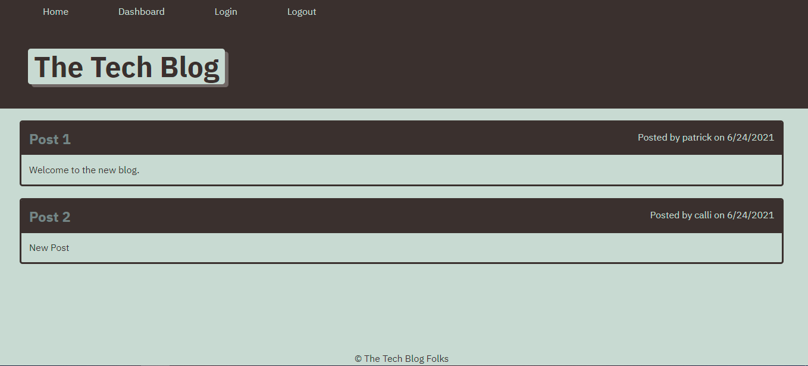

# Tech Blog
## Description
  * Generates a readme from user input.

  * https://tech-blog-prb.herokuapp.com/

  

## Table of Contents
  - [Installation](#installation)
  - [Usage](#usage)
  - [Questions](#questions)

## Installation 
* Install Node Js
* Then, in the root folder
    
        -npm i

## Usage
* In the root folder

        -node index
## Questions
  * Username: patrbraun
    * Github: https://github.com/patrbraun
  * Email: example@email.com